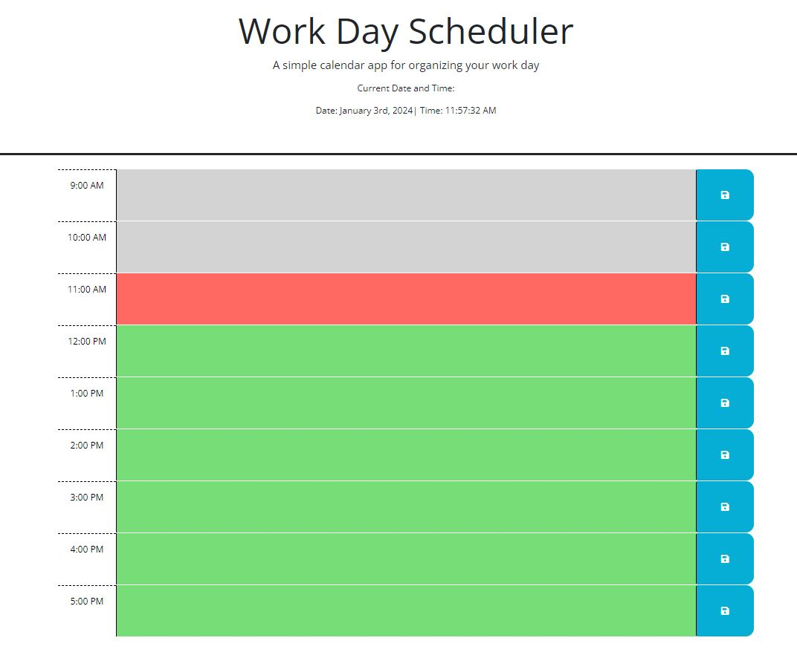

# Work-Day-Scheduler
## Descriptiom
The Work Day Scheduler is a simple calendar app that allows a user to organize the activities of a work day from 9:00 am to 5:00 pm and save them on a single page.
## Table of Contents
- [Webpage-Preview](#Webpage-Preview)
- [Custom-Features](#Custom-Features)
- [Usage](#Usage)
- [Skill-Improved](#Skill-Improved)
- [Technologies](#Technologies)
- [Author](#Author)
- [License](#license)
- [Credits](#credits)

## Webpage Preview

## Custom Features
- Toggle color by time block.
- Save data entry using jquery event handling
- Display current day and time using ordinal format
## Usage
The link for the webpage is: https://clcoder2425.github.io/Work-Day-Scheduler/

1. Load the webpage.
2. Click on the desire time block.
3. Enter your activity for the time block.
4. Click on the save icon to the right of the time block.

## Skills Improved
- JQuery: methods and events
- Dayjs fortmats
- Javascript
## Technologies
- HTML 
- JavaScript
- CSS
## Author
 Carmen Jimenez : https://github.com/clcoder2425/Work-Day-Scheduler.git
 
 ## License
  

## Credits
- MediumdotCom: https://medium.com/edureka/jquery-tutorial-for-beginners-679021d74ab4
- FreeCodeCamp: https://www.freecodecamp.org/news/format-dates-with-ordinal-number-suffixes-javascript/
- Dayjs: https://day.js.org/docs/en/get-set/get

